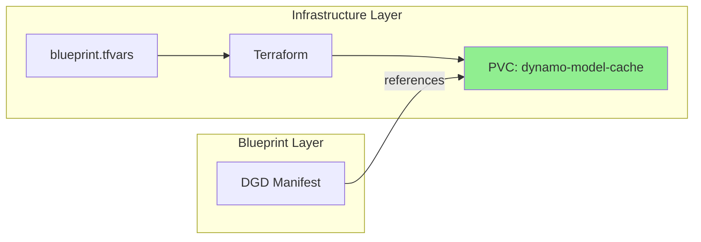
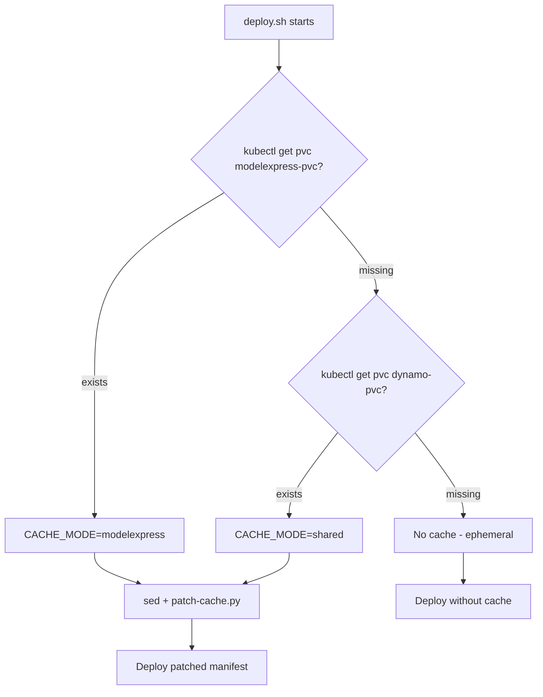
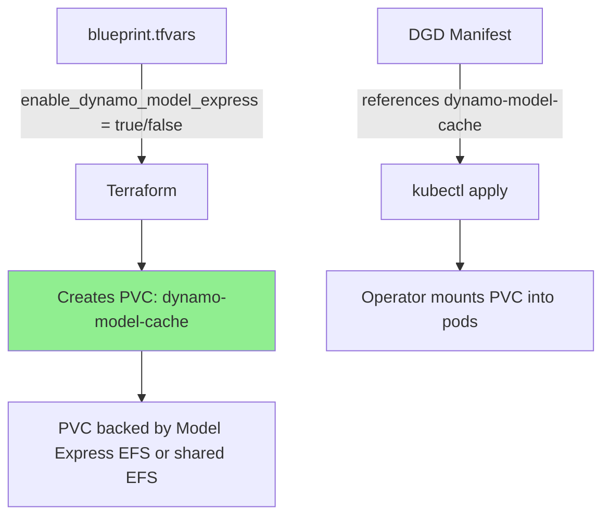
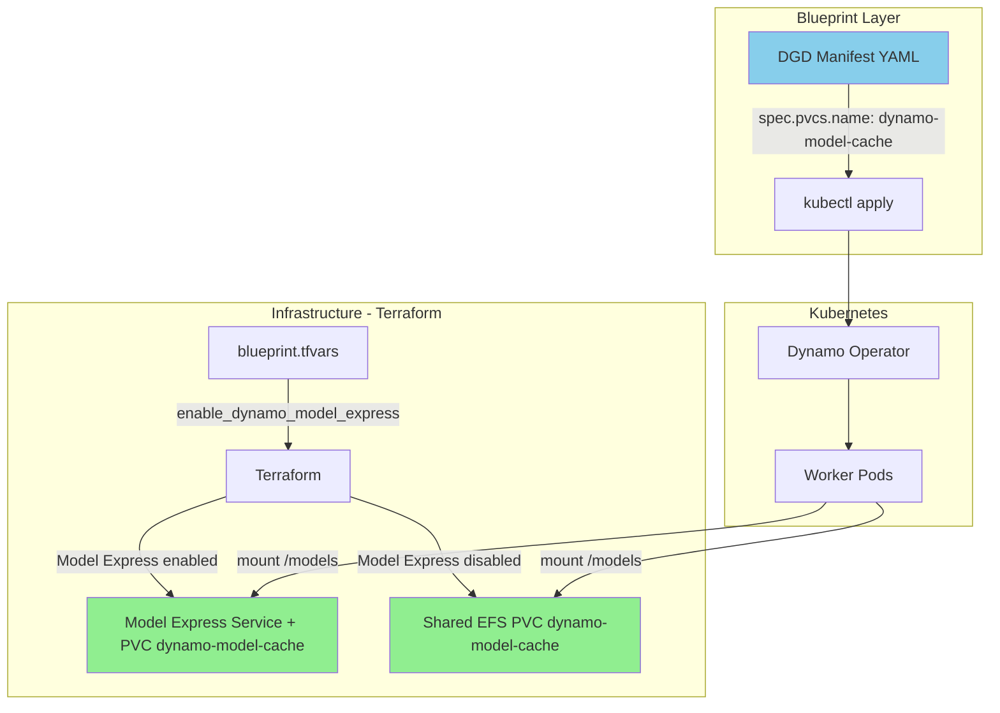

# Model-Cache & Config Architecture Redesign

> **Status**: Proposal
> **Date**: 2026-03-19
> **Scope**: Eliminate build-time YAML mutation, simplify config tooling, make cache mode declarative

---

## 1. Problem Summary

Three scripts currently collaborate to handle model-cache and config management for Dynamo blueprints. Each has structural problems:

| Script | Lines | Purpose | Problem |
|--------|-------|---------|---------|
| [`patch-cache.py`](../patch-cache.py) | 113 | Adds PVC volumeMounts + HF env vars to DGD manifests | **Redundant** — manifests already contain all PVC config |
| [`apply-config.sh`](../scripts/apply-config.sh) | 525 | Creates K8s ConfigMaps from `config/` YAML files | **Orphaned** — no manifest references these ConfigMaps |
| [`deploy.sh`](../deploy.sh) lines 902-1008 | ~106 | Auto-detects cache PVC, runs sed + patch-cache.py | **Fragile** — runtime detection + build-time YAML mutation |

### The Core Insight

After the PVC refactoring (which standardized manifests on `dynamo-model-cache` as placeholder PVC name), **manifests are already self-contained**. Examining [`vllm-aggregated-default.yaml`](../engines/vllm/vllm-aggregated-default.yaml):

```yaml
spec:
  pvcs:
    - name: dynamo-model-cache       # placeholder PVC name
      create: false
  services:
    Frontend:
      volumeMounts:
        - name: dynamo-model-cache   # already mounted
          mountPoint: /models
      envs:
        - name: HF_HOME             # already set
          value: /models
        - name: HF_HUB_CACHE        # already set
          value: /models
    VllmWorker:
      volumeMounts:
        - name: dynamo-model-cache   # already mounted
          mountPoint: /models
      envs:
        - name: HF_HOME             # already set
          value: /models
        - name: HF_HUB_CACHE        # already set
          value: /models
```

`patch-cache.py` was needed when manifests lacked PVC config. Now it checks for existing entries, finds them, and skips — doing nothing. The only useful work `deploy.sh` does is `sed s/dynamo-model-cache/${ACTUAL_PVC}/g` — a placeholder replacement.

---

## 2. Proposed Architecture

### Principle: Infrastructure names the PVC, manifests use a stable contract name



**The fix is architectural, not scripting:** Make Terraform create the PVC with the same name manifests already reference (`dynamo-model-cache`), regardless of whether the backing storage is Model Express EFS or shared EFS. This eliminates all runtime detection and YAML mutation.

### Design Decision: Unified PVC Name

| Current State | Proposed State |
|--------------|----------------|
| Manifests use `dynamo-model-cache` placeholder | Manifests use `dynamo-model-cache` as **real** PVC name |
| Infrastructure creates `modelexpress-pvc` or `dynamo-pvc` | Infrastructure creates `dynamo-model-cache` — always |
| `deploy.sh` detects which PVC exists, sed-replaces | `deploy.sh` does nothing — name already matches |
| `patch-cache.py` adds PVC config to manifests | Deleted — manifests already have PVC config |

### Cache Mode Differences

The two modes differ only in what populates the PVC — the manifest-side config is identical:

| Aspect | Model Express Mode | Shared EFS Mode |
|--------|-------------------|-----------------|
| PVC Name | `dynamo-model-cache` | `dynamo-model-cache` |
| PVC backing | EFS via Model Express Helm chart | EFS via Terraform |
| Who downloads models | Model Express service | Worker pods on first run |
| Manifest changes needed | None | None |
| `HF_HOME` env var | `/models` | `/models` |
| `HF_HUB_CACHE` env var | `/models` | `/models` |

> **Note on `HF_HUB_CACHE`:** Model Express stores HF hub cache entries at PVC root, so `HF_HUB_CACHE=/models` is correct. For self-download mode, setting `HF_HUB_CACHE=/models` also works — it just puts cache entries at root instead of the default `/models/hub` subdirectory. Both approaches are functionally equivalent and avoid needing per-mode env var differences.

---

## 3. What To Do With Each Script

### 3.1 `patch-cache.py` — DELETE

**Verdict: Remove entirely.**

**Evidence it is redundant:**
- All current manifests already include `spec.pvcs`, `volumeMounts`, and HF env vars
- The script checks for existing entries before adding — it finds them and skips
- The only env var difference between modes (`HF_HUB_CACHE=/models` vs `/models/hub`) is eliminated by standardizing on `/models` for both modes

**Risk:** Zero. Removing a no-op script.

### 3.2 `apply-config.sh` — DELETE (with config/ files reclassified)

**Verdict: Remove the script. Reclassify `config/` files as documentation-only reference.**

**Evidence it is unused:**
- `apply-config.sh` creates ConfigMaps: `dynamo-common-env`, `dynamo-env-development`, `dynamo-env-production`, `dynamo-env-pcie`, `dynamo-env-nvlink`
- **No DGD manifest references any of these ConfigMaps** — there are no `configMapRef` or `envFrom` fields pointing to them
- [`images.yaml`](../config/images.yaml) already self-documents as `STATUS: DOCUMENTATION ONLY`
- [`resource-profiles.yaml`](../config/resource-profiles.yaml) is never consumed by any tooling
- `node-selectors.yaml` is referenced in scripts but doesn't exist

**What to keep:** The `config/` YAML files themselves are useful as **reference documentation** for operators who want to understand what env vars are available, what resource profiles look like, etc. They just shouldn't pretend to be operational config.

**Action:**
1. Delete [`scripts/apply-config.sh`](../scripts/apply-config.sh)
2. Add a header to [`config/common-env.yaml`](../config/common-env.yaml) marking it `STATUS: REFERENCE ONLY`
3. Remove the `--apply-configs` flag from [`deploy.sh`](../deploy.sh)
4. Update [`config/README.md`](../config/README.md) to clarify these are reference docs, not operational config

### 3.3 `deploy.sh` cache section — SIMPLIFY to validation-only

**Verdict: Replace 106 lines of detection+patching with a ~15-line validation check.**

The current flow (lines 902-1008) does:
1. Check if `modelexpress-pvc` exists → set mode
2. Check if `dynamo-pvc` exists → set mode
3. Run `sed` to replace placeholder PVC name
4. Run `patch-cache.py` to add PVC config
5. Handle failures gracefully

The proposed flow:
1. Verify `dynamo-model-cache` PVC exists in namespace
2. If missing → warn and proceed (ephemeral storage fallback)
3. Done — no patching needed

```bash
# --- Proposed replacement for lines 902-1008 ---
if [ "${RESOURCE_KIND}" = "DynamoGraphDeployment" ]; then
    section "Model Cache Validation"

    if kubectl get pvc "dynamo-model-cache" -n "${TARGET_NAMESPACE}" &>/dev/null; then
        PVC_SIZE=$(kubectl get pvc "dynamo-model-cache" -n "${TARGET_NAMESPACE}" \
            -o jsonpath='{.spec.resources.requests.storage}')
        PVC_CLASS=$(kubectl get pvc "dynamo-model-cache" -n "${TARGET_NAMESPACE}" \
            -o jsonpath='{.spec.storageClassName}')
        success "Model cache PVC found: dynamo-model-cache (${PVC_SIZE}, ${PVC_CLASS})"
    else
        warn "PVC 'dynamo-model-cache' not found in namespace '${TARGET_NAMESPACE}'"
        warn "Pods will use ephemeral storage — models re-download on every restart"
        warn "Create PVC via Terraform: enable_dynamo_model_express=true or configure shared EFS"
    fi
fi
```

---

## 4. Cache Mode as Declarative Config

### Current: Runtime Detection (Fragile)



### Proposed: Declarative Config (Simple)



The cache mode is **already** a declarative config knob in [`blueprint.tfvars`](../../../../infra/nvidia-dynamo/terraform/blueprint.tfvars):

```hcl
# Option 1: Model Express (managed service)
enable_dynamo_model_express = true

# Option 2: Shared EFS (simple PVC) — used when Model Express is disabled
# dynamo_shared_cache_size = "500Gi"
```

The only missing piece is that Terraform doesn't create a PVC named `dynamo-model-cache` — it creates `modelexpress-pvc` or `dynamo-pvc`. Renaming the Terraform output to `dynamo-model-cache` closes the loop.

---

## 5. Concrete File Changes

### Phase 1: Infrastructure — Rename PVC Output

| File | Change | Impact |
|------|--------|--------|
| Terraform PVC resource (Model Express path) | Output PVC name as `dynamo-model-cache` instead of `modelexpress-pvc` | Manifests work without sed |
| Terraform PVC resource (shared EFS path) | Output PVC name as `dynamo-model-cache` instead of `dynamo-pvc` | Same |
| [`blueprint.tfvars`](../../../../infra/nvidia-dynamo/terraform/blueprint.tfvars) | No change — `enable_dynamo_model_express` already controls which path runs | None |

### Phase 2: Delete Redundant Scripts

| File | Action | Lines Removed |
|------|--------|---------------|
| [`patch-cache.py`](../patch-cache.py) | Delete | 113 |
| [`scripts/apply-config.sh`](../scripts/apply-config.sh) | Delete | 525 |
| **Total** | | **638 lines** |

### Phase 3: Simplify deploy.sh

| Section | Current Lines | Proposed Lines | Change |
|---------|--------------|----------------|--------|
| Cache detection + patching (902-1008) | ~106 | ~15 | Replace with PVC existence check |
| `--apply-configs` flag handling | ~20 | 0 | Remove flag entirely |
| `apply_centralized_configs()` function (393-422) | ~30 | 0 | Remove function |
| CACHE_MODE env export | ~5 | 0 | Remove |
| **Total reduction** | ~161 lines | ~15 lines | **-146 lines** |

### Phase 4: Reclassify Config Files

| File | Change |
|------|--------|
| [`config/common-env.yaml`](../config/common-env.yaml) | Add `STATUS: REFERENCE ONLY` header |
| [`config/resource-profiles.yaml`](../config/resource-profiles.yaml) | Add `STATUS: REFERENCE ONLY` header |
| [`config/images.yaml`](../config/images.yaml) | Already marked — no change |
| [`config/README.md`](../config/README.md) | Update to clarify reference-only status |

### Phase 5: Cleanup References

| Location | Change |
|----------|--------|
| `deploy.sh` usage text | Remove `--apply-configs` option |
| `deploy.sh` next-steps output | Remove `apply-config.sh` references |
| Blueprint README | Remove `apply-config.sh` instructions |
| `scripts/README.md` | Remove `apply-config.sh` entry |

### Summary: Net Impact

| Metric | Before | After | Delta |
|--------|--------|-------|-------|
| Script files | 3 (`patch-cache.py`, `apply-config.sh`, `deploy.sh`) | 1 (`deploy.sh`) | -2 files |
| Total script lines | ~1917 | ~1133 | -784 lines |
| Runtime kubectl calls for cache | 2-4 (PVC checks + patching) | 1 (PVC existence check) | -75% |
| Temp files created | 2 (patched manifest + cache manifest) | 0 | Clean working tree |
| Build-time YAML mutation | Yes (sed + Python patcher) | No | Eliminated |

---

## 6. Migration Path

### Step 1: Terraform — Rename PVC (Breaking Change, Managed)

This is the critical enabling change. All subsequent simplifications depend on it.

**For Model Express path:**
```hcl
# Change the PVC name in the Model Express Helm values or post-install resource
# FROM: modelexpress-pvc
# TO:   dynamo-model-cache
```

**For shared EFS path:**
```hcl
# Change the PVC name in the EFS provisioner
# FROM: dynamo-pvc
# TO:   dynamo-model-cache
```

**Migration for existing clusters:** Create a new PVC `dynamo-model-cache` pointing to the same EFS filesystem/access point as the old PVC. Old PVCs can coexist during transition.

### Step 2: Verify Manifests Work Without Patching

Deploy one manifest (`vllm-aggregated-default`) directly with `kubectl apply` — no `deploy.sh`:
```bash
kubectl apply -f engines/vllm/vllm-aggregated-default.yaml -n dynamo
```

Verify: pods mount `dynamo-model-cache` PVC, `HF_HOME=/models` is set, model loads correctly.

### Step 3: Simplify deploy.sh

Replace the cache detection/patching block with the validation-only version from Section 3.3.

### Step 4: Delete patch-cache.py and apply-config.sh

After Step 2 confirms manifests are self-sufficient:
```bash
git rm patch-cache.py
git rm scripts/apply-config.sh
```

### Step 5: Update Documentation

- Mark config/ files as reference-only
- Update README to remove apply-config.sh instructions
- Update this doc status to "Implemented"

### Rollback Plan

If the unified PVC name causes issues (e.g., Model Express Helm chart requires `modelexpress-pvc`):

1. Keep the old PVC names in Terraform
2. Restore the sed replacement in deploy.sh (one line: `sed "s/dynamo-model-cache/${ACTUAL_PVC}/g"`)
3. Do NOT restore patch-cache.py — it's redundant regardless of PVC naming

---

## 7. Edge Cases and Risks

### Risk 1: Model Express Helm chart hardcodes PVC name

**Impact:** High — if the chart creates `modelexpress-pvc` internally and we can't rename it.
**Mitigation:** If the chart name is fixed, add a one-line sed in deploy.sh as a fallback. But check the chart values first — most Helm charts allow PVC name overrides.

### Risk 2: Existing clusters have data in old PVCs

**Impact:** Medium — model cache would need re-downloading.
**Mitigation:** Create `dynamo-model-cache` PVC pointing to the same EFS access point as the old PVC. EFS supports multiple PVCs backed by the same filesystem.

### Risk 3: DGDR manifests with embedded ConfigMaps

**Impact:** Low — some DGDR manifests have PVC references inside embedded YAML strings in ConfigMap `data` fields.
**Mitigation:** These already use `dynamo-model-cache` as the placeholder. As long as Terraform creates a PVC with that exact name, no changes needed.

### Risk 4: `HF_HUB_CACHE=/models` vs `/models/hub` for shared mode

**Impact:** Low — both work. The only difference is directory structure inside the PVC.
**Mitigation:** Standardize on `HF_HUB_CACHE=/models` for both modes. Workers store cache at PVC root regardless of who downloads the model.

---

## 8. Architecture After Implementation



**What's gone:**
- No `patch-cache.py`
- No `apply-config.sh`
- No runtime PVC detection in `deploy.sh`
- No build-time YAML mutation
- No temp files

**What remains:**
- Manifests: self-contained, reference `dynamo-model-cache` PVC by name
- `deploy.sh`: validates PVC exists, applies manifest, waits for readiness
- `config/`: reference documentation for operators
- `blueprint.tfvars`: single declarative knob controls cache mode

---

## Appendix A: Files Inventory

### Files to DELETE

| File | Lines | Reason |
|------|-------|--------|
| `patch-cache.py` | 113 | Redundant — manifests already have PVC config |
| `scripts/apply-config.sh` | 525 | Orphaned — ConfigMaps not referenced by any manifest |

### Files to MODIFY

| File | Change |
|------|--------|
| `deploy.sh` | Remove cache detection/patching block (~146 lines), remove `--apply-configs` flag |
| `config/common-env.yaml` | Mark as `STATUS: REFERENCE ONLY` |
| `config/resource-profiles.yaml` | Mark as `STATUS: REFERENCE ONLY` |
| `config/README.md` | Clarify reference-only status |
| Terraform PVC resources | Rename output PVC to `dynamo-model-cache` |

### Files UNCHANGED

| File | Reason |
|------|--------|
| All DGD manifests under `engines/`, `models/`, `features/` | Already use `dynamo-model-cache` — no changes needed |
| `blueprint.tfvars` | Already has the declarative cache mode knob |
| `config/images.yaml` | Already marked documentation-only |
| `config/otel-collector.yaml` | Operational config, correctly applied by deploy.sh tracing path |
| `config/otel-instrumentation.yaml` | Operational config, correctly applied by deploy.sh tracing path |
