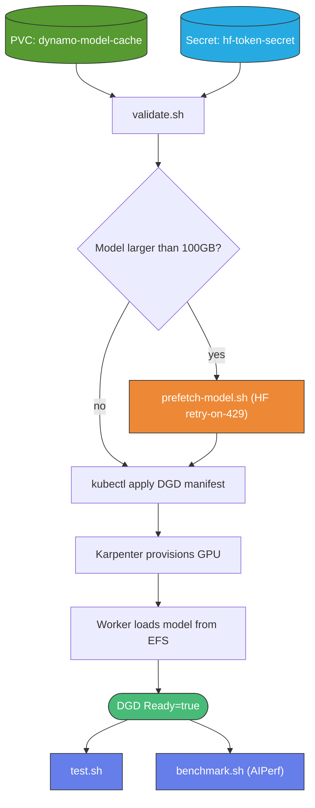
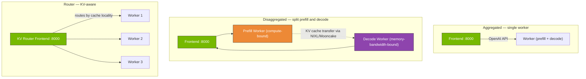
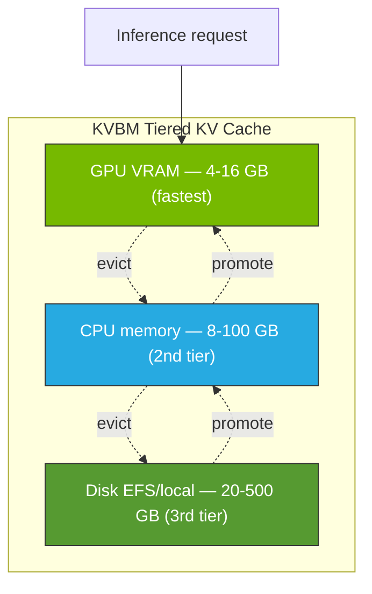

:::info
This page covers deploying inference workloads on a running Dynamo platform.
For platform installation (EKS cluster, operator, Grove, KAI, Tempo), see the
[NVIDIA Dynamo on EKS infrastructure guide](/docs/infra/inference/nvidia-dynamo)
first.
:::

# NVIDIA Dynamo Blueprints

This blueprint provides 28 live-tested DynamoGraphDeployment (DGD) examples
covering all of Dynamo v1.0.1's major capabilities, plus operational tooling
for testing, benchmarking, prefetching models, and validating deployments.

## Prerequisites

- A running Dynamo platform on EKS — see the
  [infrastructure guide](/docs/infra/inference/nvidia-dynamo)
- `kubectl` configured for your cluster (run `aws eks update-kubeconfig`)
- Working directory: `blueprints/inference/nvidia-dynamo/` in the ai-on-eks repo

## Quick Start

```bash
cd blueprints/inference/nvidia-dynamo

# 1. Create the shared PVC and HF token secret
kubectl apply -f pvc.yaml
kubectl create secret generic hf-token-secret \
  --from-literal=HF_TOKEN="$HF_TOKEN" \
  -n dynamo-system --dry-run=client -o yaml | kubectl apply -f -

# 2. Validate the cluster
./scripts/validate.sh

# 3. Deploy the smallest DGD (Qwen3-0.6B on g5 A10G)
kubectl apply -f engines/vllm/vllm-aggregated.yaml -n dynamo-system

# 4. Test once Ready
./test.sh vllm-aggregated
```

## Deployment Workflow



### 1. Create the shared PVC

The PVC `dynamo-model-cache` (500GB EFS, ReadWriteMany) is mounted by every
DGD at `/models` and shared across all workloads. Models downloaded by one
DGD are immediately available to all others.

```bash
kubectl apply -f pvc.yaml
```

### 2. Create the HuggingFace token secret

```bash
kubectl create secret generic hf-token-secret \
  --from-literal=HF_TOKEN="$HF_TOKEN" \
  -n dynamo-system --dry-run=client -o yaml | kubectl apply -f -
```

Most blueprints reference this secret via `envFromSecret: hf-token-secret`
in their DGD spec. While anonymous downloads work for public models, the
HF token enables 5000+ req/min vs ~50 req/min anonymous — essential for
models >10GB.

### 3. Validate the cluster

```bash
./scripts/validate.sh
```

Checks for required CRDs, PVC, HF token secret, Karpenter NodePools, and
Dynamo operator health. Exits non-zero on any FAIL.

### 4. Prefetch large models (mandatory for models >100GB)

Dynamo's internal `fetch_model()` has no retry logic for HuggingFace 429 rate
limits. Large models (100+ shards) will crash-loop during download. The
`prefetch-model.sh` helper pre-warms the EFS cache using `huggingface_hub`'s
retry-with-backoff Python client.

```bash
# Prefetch before deploying the DGD
./scripts/prefetch-model.sh MiniMaxAI/MiniMax-M2.7
./scripts/prefetch-model.sh deepseek-ai/DeepSeek-R1-Distill-Llama-70B

# Then deploy — download phase is skipped, weights loaded from EFS
kubectl apply -f models/minimax-m2.7.yaml -n dynamo-system
```

The helper:
- Auto-derives a K8s-safe Job name from the model ID
- Uses `HF_TOKEN` from `hf-token-secret` if present
- Retries on 429/5xx up to 30 times with exponential backoff
- Is idempotent — rerunning resumes from where it stopped
- Auto-cleans up the Job 1 hour after completion
- Streams logs while running

### 5. Deploy the DGD

Apply any blueprint manifest. Karpenter will provision the required GPU
nodes based on the `nodeSelector` in the manifest.

```bash
kubectl apply -f models/minimax-m2.7.yaml -n dynamo-system

kubectl wait --for=jsonpath='{.status.ready}'=true \
  dgd/minimax-m2-7 -n dynamo-system --timeout=15m
```

### 6. Test the DGD

```bash
./test.sh minimax-m2-7     # Specific DGD
./test.sh                  # All deployed DGDs
```

`test.sh` port-forwards to the DGD's frontend service, hits `/health` and
`/v1/chat/completions`, and reports pass/fail. It handles reasoning models
(MiniMax, DeepSeek R1, GLM) that return output in `reasoning_content`
instead of `content`.

### 7. Benchmark

```bash
# Default: ISL=128, OSL=128, concurrency=1,4,8
./scripts/benchmark.sh minimax-m2-7

# Custom sequence lengths
./scripts/benchmark.sh minimax-m2-7 --isl 2048 --osl 256 --concurrency 1,4,8

# Concurrency sweep (1,2,4,8,16,32,64)
./scripts/benchmark.sh minimax-m2-7 --sweep
```

The script runs [AIPerf](https://github.com/ai-dynamo/aiperf) via in-cluster
Kubernetes Jobs using the Dynamo runtime image (AIPerf is pre-installed).
Results are saved to `/tmp/dynamo-benchmarks/<dgd>/<timestamp>/` including
CSV/JSON exports and an LLM metrics table (TTFT, ITL, throughput).

## Blueprint Catalog

### Engine Architecture Patterns



### Engines (10 blueprints)

Architecture patterns on the smallest usable hardware (Qwen3-0.6B on g5 A10G).

| Blueprint | Pattern | Location |
|-----------|---------|----------|
| vLLM aggregated / disagg / router / disagg+router | 4 patterns | [`engines/vllm/`](https://github.com/awslabs/ai-on-eks/tree/main/blueprints/inference/nvidia-dynamo/engines/vllm) |
| SGLang aggregated / disagg / router | 3 patterns | [`engines/sglang/`](https://github.com/awslabs/ai-on-eks/tree/main/blueprints/inference/nvidia-dynamo/engines/sglang) |
| TRT-LLM aggregated / disagg / router | 3 patterns | [`engines/trtllm/`](https://github.com/awslabs/ai-on-eks/tree/main/blueprints/inference/nvidia-dynamo/engines/trtllm) |

**Hardware notes:**
- TRT-LLM disaggregated requires Hopper/Blackwell (B200+) due to its
  `cache_transceiver_config` requirements. A10G and L40S fail with executor
  errors. Use `g7e-nvidia` NodePool.

### Models (5 blueprints)

Production-scale deployments with hardware sizing.

| Model | Params | Hardware | Architecture |
|-------|--------|----------|--------------|
| DeepSeek R1 | 671B MoE | 2× p5e / p6-b200 | MLA (**Hopper/Blackwell only**) |
| DeepSeek R1 Distill Llama | 70B | 1× g7e (RTX PRO 6000) | Standard GQA |
| Llama 3.3 | 70B | 1× g7e | Standard GQA |
| MiniMax-M2.7 | 230B / 10B active | 1× g7e.48xlarge TP=4 | Sparse MoE + MHA |
| Qwen3-30B-A3B | 30B / 3B active | 1× g7e | Sparse MoE |

:::warning MLA Hardware Requirement
DeepSeek R1 (671B) uses Multi-head Latent Attention (MLA) which requires
**Hopper (H100/H200) or Blackwell (B200/B300)** compute capability. vLLM
has no MLA backend for Ada Lovelace (RTX PRO 6000). For reasoning workloads
on widely-available hardware, use the distilled variant.
:::

### KV Block Manager (KVBM) Tiered Cache



### Features (13 blueprints)

| Category | Examples | Location |
|----------|----------|----------|
| KVBM (KV Block Manager) | CPU cache, 3-tier disk offload | [`features/kvbm-*.yaml`](https://github.com/awslabs/ai-on-eks/tree/main/blueprints/inference/nvidia-dynamo/features) |
| Model management | DynamoModel CRDs, LoRA adapters | [`features/model-management/`](https://github.com/awslabs/ai-on-eks/tree/main/blueprints/inference/nvidia-dynamo/features/model-management) |
| Multimodal | Qwen2.5-VL, LLaVA-1.5, LLaVA-Video | [`features/multimodal/`](https://github.com/awslabs/ai-on-eks/tree/main/blueprints/inference/nvidia-dynamo/features/multimodal) |
| Observability | OTEL tracing, full observability, audit logging | [`features/observability/`](https://github.com/awslabs/ai-on-eks/tree/main/blueprints/inference/nvidia-dynamo/features/observability) |
| Advanced | Multi-replica HA, heterogeneous GPUs, DGDRs | [`features/`](https://github.com/awslabs/ai-on-eks/tree/main/blueprints/inference/nvidia-dynamo/features) |

### DynamoGraphDeploymentRequest (DGDR)

DGDRs automate profiling and deployment. Apply a DGDR → Dynamo profiles the
workload for hours → optimal DGD is auto-created.

```bash
kubectl apply -f features/dgdr-vllm.yaml -n dynamo-system
kubectl get dgdr -n dynamo-system -w     # Monitor profiling
kubectl get dgd -n dynamo-system -w      # Auto-generated DGD
```

DGDR requires `kube-prometheus-stack` (enabled by default in the infra).

## Observability

### Distributed Tracing (Grafana Tempo)

Tempo is deployed by default with the platform. Blueprints in
`features/observability/` demonstrate end-to-end OTEL integration:

```bash
# Deploy a traced vLLM DGD
kubectl apply -f features/observability/otel-tracing.yaml -n dynamo-system

# Test (generates traces)
./test.sh vllm-otel-tracing

# Query Tempo for traces
kubectl port-forward svc/grafana-tempo 3200:3200 -n tempo &
curl -s "http://localhost:3200/api/search?q={}" | python3 -m json.tool
```

The OTEL endpoint is `grafana-tempo.tempo.svc.cluster.local:4317`
(gRPC) or `:4318` (HTTP). Traced blueprints set these env vars:

```yaml
envs:
  - name: OTEL_EXPORTER_OTLP_ENDPOINT
    value: http://grafana-tempo.tempo.svc.cluster.local:4317
  - name: OTEL_SERVICE_NAME
    value: dynamo-vllm-worker
```

### Metrics (Prometheus + Grafana)

```bash
# Grafana UI
kubectl port-forward svc/kube-prometheus-stack-grafana 3000:80 \
  -n kube-prometheus-stack

# Prometheus UI
kubectl port-forward svc/kube-prometheus-stack-prometheus 9090:9090 \
  -n kube-prometheus-stack
```

Per-DGD metrics are scraped via the `servicemonitor-template.yaml` in the
blueprint root. Apply after deploying a DGD to begin scraping its `/metrics`
endpoint on port 9090.

### Audit Logging

`features/observability/audit-logging.yaml` demonstrates JSONL request/response
audit logging. Useful for compliance and debugging inference workloads.

## Troubleshooting

### Large model downloads crash-loop with HTTP 429

**Symptom**: Worker pod crashes with `HfHubHTTPError: 429 Too Many Requests`.
On restart, a few more shards download before crashing again. Never completes.

**Cause**: Dynamo's `fetch_model()` doesn't retry on HF rate limits.

**Fix**: Use `./scripts/prefetch-model.sh <model>` before deploying the DGD.

### Models on Ada Lovelace (RTX PRO 6000) won't run

**Symptom**: `ValueError: No valid attention backend found for cuda` on
DeepSeek, GLM-5.x, or other MLA-architecture models.

**Cause**: The model uses Multi-head Latent Attention (MLA) which requires
Hopper (H100/H200) or Blackwell (B200/B300). vLLM has no MLA backend for
Ada architecture.

**Fix**: Use a distilled variant (e.g., `models/deepseek-r1-distill-llama-70b.yaml`)
or deploy on `p5-nvidia` / `p5e-nvidia` / `p6-b200-nvidia` NodePools.

### TRT-LLM disaggregated fails on A10G or L40S

**Symptom**: "Executor worker returned error" regardless of memory tuning.

**Cause**: TRT-LLM's `cache_transceiver_config` requires Hopper/Blackwell
for its IPC mechanism.

**Fix**: Change nodeSelector to `g7e-nvidia` (B200). Aggregated TRT-LLM works
on all GPU tiers.

### Inference returns `null` in the content field

**Symptom**: `choices[0].message.content` is `null` but the request
succeeded.

**Cause**: Reasoning models (DeepSeek R1, MiniMax M2, GLM) separate their
chain-of-thought into `reasoning_content`, leaving `content` as the final
answer only.

**Fix**: Inspect both fields. The `test.sh` script handles this fallback
automatically.

## Configuration Reference

Each DGD manifest can be customized in these ways:

### nodeSelector

```yaml
extraPodSpec:
  nodeSelector:
    karpenter.sh/nodepool: g7e-nvidia    # Change GPU pool
```

Available pools (see the
[infrastructure guide](/docs/infra/inference/nvidia-dynamo) for the full list):
`g5-nvidia`, `g6-nvidia`, `g6e-nvidia`, `g7e-nvidia`, `p5-nvidia`,
`p5e-nvidia`, `p5en-nvidia`, `p6-b200-nvidia`, `p6-b300-nvidia`.

### Image versions

```yaml
image: nvcr.io/nvidia/ai-dynamo/vllm-runtime:1.0.1
```

Also available: `sglang-runtime:1.0.1`, `tensorrtllm-runtime:1.0.1`,
`dynamo-frontend:1.0.1`. When v1.1.0 is published to NGC, update all tags.

### Model and TP size

```yaml
args:
  - python3 -m dynamo.vllm
  - --model
  - meta-llama/Llama-3.3-70B-Instruct
  - --tensor-parallel-size
  - "2"
```

### Resources

```yaml
resources:
  requests:
    cpu: "16"
    memory: "100Gi"
    gpu: "2"
  limits:
    cpu: "16"
    memory: "100Gi"
    gpu: "2"
```

Match memory to the instance type (g7e.24xlarge has 384GB RAM; request
≤200Gi to leave headroom for system).

## Cleaning Up

Delete a specific DGD:

```bash
kubectl delete dgd minimax-m2-7 -n dynamo-system
```

Delete all DGDs:

```bash
kubectl delete dgd --all -n dynamo-system
```

For complete infrastructure teardown, see the
[infrastructure guide's cleanup section](/docs/infra/inference/nvidia-dynamo#clean-up).

## References

### Blueprint Resources

- [Blueprint directory](https://github.com/awslabs/ai-on-eks/tree/main/blueprints/inference/nvidia-dynamo) — all manifests + tooling
- [Engines README](https://github.com/awslabs/ai-on-eks/blob/main/blueprints/inference/nvidia-dynamo/engines/README.md)
- [Models README](https://github.com/awslabs/ai-on-eks/blob/main/blueprints/inference/nvidia-dynamo/models/README.md)
- [Features README](https://github.com/awslabs/ai-on-eks/blob/main/blueprints/inference/nvidia-dynamo/features/README.md)
- [Model management README](https://github.com/awslabs/ai-on-eks/blob/main/blueprints/inference/nvidia-dynamo/features/model-management/README.md)
- [Observability README](https://github.com/awslabs/ai-on-eks/blob/main/blueprints/inference/nvidia-dynamo/features/observability/README.md)

### Inference Frameworks

- [vLLM](https://github.com/vllm-project/vllm) — high-throughput LLM inference engine
- [SGLang](https://github.com/sgl-project/sglang) — structured generation with RadixAttention
- [TensorRT-LLM](https://github.com/NVIDIA/TensorRT-LLM) — NVIDIA optimized inference

### Other

- [AIPerf benchmarking](https://github.com/ai-dynamo/aiperf)
- [NVIDIA Dynamo docs](https://docs.nvidia.com/dynamo/latest/)
- Infrastructure guide: [/docs/infra/inference/nvidia-dynamo](/docs/infra/inference/nvidia-dynamo)
