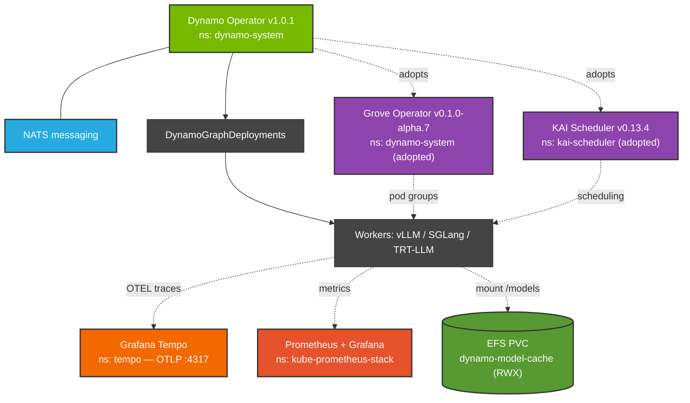
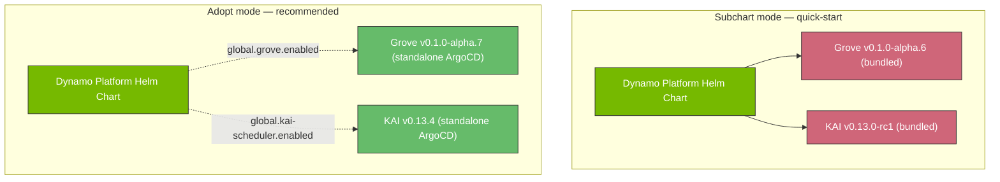
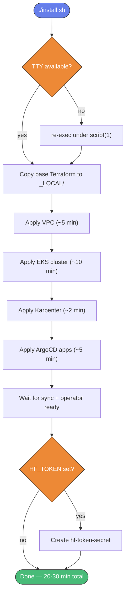

import CollapsibleContent from '@site/src/components/CollapsibleContent';

# NVIDIA Dynamo on EKS

:::warning
Deployment of ML models on EKS requires access to GPUs. If your deployment
isn't working, it's often due to missing access to these resources. Some
patterns rely on Karpenter autoscaling; if nodes aren't initializing, check
the logs for Karpenter or your NodePool for capacity errors.
:::

:::info
These instructions only deploy the Dynamo platform (operator, NATS, optional
Grove + KAI schedulers, optional Grafana Tempo) as a base. To deploy specific
inference workloads on top of this platform, see the
[Dynamo blueprint](/docs/blueprints/inference/framework-guides/gpus/nvidia-dynamo)
page.
:::

### What is NVIDIA Dynamo?

[NVIDIA Dynamo](https://github.com/ai-dynamo/dynamo) is an open-source
datacenter-scale distributed inference serving framework designed to optimize
performance and scalability for large language models (LLMs) and generative
AI applications. Released under the Apache 2.0 license, Dynamo orchestrates
complex AI workloads across multiple GPUs and nodes with features like
disaggregated serving, KV-aware routing, and multi-engine support.

This blueprint deploys **Dynamo platform v1.0.1** from the
[NVIDIA NGC catalog](https://catalog.ngc.nvidia.com/orgs/nvidia/teams/ai-dynamo/helm-charts/dynamo-platform)
onto Amazon EKS with a modular, production-ready architecture.

### Key Features and Benefits

- **Inference Engine Agnostic**: supports vLLM, SGLang, and TensorRT-LLM runtimes
- **Disaggregated Serving**: separates prefill and decode phases across GPUs
- **KV-Aware Routing**: minimizes cache recomputation by routing to workers with cached context
- **NIXL Library**: low-latency cross-worker KV transfer over TCP or RDMA
- **KV Block Manager (KVBM)**: intelligent offload across GPU → CPU → disk tiers
- **Modular adopt-or-provision architecture**: Grove, KAI Scheduler, and Tempo each deployable as subcharts or standalone ArgoCD apps
- **EKS Optimized**: Karpenter NodePools for g5/g6/g6e/g7e/p5/p5e/p5en/p6-b200/p6-b300
- **Observability Stack**: Prometheus, Grafana, Grafana Tempo for distributed tracing

### Architecture



The blueprint provisions the following components on EKS:

| Component | Source | Namespace |
|-----------|--------|-----------|
| **Dynamo operator + NATS** | NGC platform chart v1.0.1 | `dynamo-system` |
| **Grove scheduler** (optional) | Standalone ArgoCD app, v0.1.0-alpha.7 | `dynamo-system` |
| **KAI Scheduler** (optional) | Standalone ArgoCD app, v0.13.4 | `kai-scheduler` |
| **Grafana Tempo** (optional) | Standalone ArgoCD app | `tempo` |
| **kube-prometheus-stack** | ArgoCD app | `kube-prometheus-stack` |
| **nvidia-gpu-operator** | ArgoCD app | `gpu-operator` |

#### Modular: adopt-or-provision

Grove, KAI, and Tempo can each be deployed in two modes:

- **Subchart mode** (`dynamo_grove_install=true`, etc.) — the Dynamo platform
  Helm chart installs them at bundled versions. Simplest quick-start.
- **Adopt mode** (`dynamo_grove_adopt=true`, etc.) — separate standalone
  ArgoCD apps install them at user-chosen versions, then the Dynamo operator
  adopts the external instances. Recommended for production to avoid
  bundled-version bugs and enable independent upgrades.



The default configuration uses **adopt mode** for Grove and KAI because the
bundled Grove alpha.6 has a cert-rotation restart loop that affects ArgoCD
deployments. Using adopt mode with alpha.7 + `webhookServerSecret.enabled=false`
resolves this.

<CollapsibleContent header={<h2><span>Deploying the Solution</span></h2>}>

In this [example](https://github.com/awslabs/ai-on-eks/tree/main/infra/nvidia-dynamo),
you will provision the Dynamo platform on Amazon EKS.

### Prerequisites

Ensure that you have installed the following tools on your machine:

1. [aws cli](https://docs.aws.amazon.com/cli/latest/userguide/install-cliv2.html) configured with appropriate permissions
2. [kubectl](https://kubernetes.io/docs/tasks/tools/) 1.30+
3. [helm](https://helm.sh/docs/intro/install/) 3.15+
4. [terraform](https://learn.hashicorp.com/tutorials/terraform/install-cli) 1.8+

**API tokens:**

- **NGC API token**: NOT required. The Dynamo platform Helm chart and runtime
  container images are publicly available on NGC.
- **HuggingFace token** (optional): not strictly required, but strongly
  recommended. Anonymous rate limits (~50 req/min) make large model downloads
  (>100GB) take hours. Set `HF_TOKEN` in your environment before running
  `install.sh` or when creating the `hf-token-secret` Secret later.

### Deploy

```bash
git clone https://github.com/awslabs/ai-on-eks.git
cd ai-on-eks/infra/nvidia-dynamo
./install.sh
```

The `install.sh` script is fully unattended — it auto-detects TTY-less
environments and wraps itself with `script(1)` so it works from CI/CD
pipelines, remote shells, or background sessions.

**Install flow:**



**Typical duration**: 20-30 minutes (VPC + EKS is ~15 min, the rest ~5-10 min).

**What you get:**

- EKS cluster `dynamo-on-eks` in `us-west-2` (region configurable)
- 11 Karpenter NodePools: `g5-nvidia`, `g6-nvidia`, `g6e-nvidia`,
  `g7e-nvidia`, `p5-nvidia`, `p5e-nvidia`, `p5en-nvidia`, `p6-b200-nvidia`,
  `p6-b300-nvidia`, `inf2-neuron`, `m6i-cpu`
- EFS StorageClass `efs-sc-dynamic` (ReadWriteMany, multi-AZ)
- All 9 ArgoCD applications Synced and Healthy
- Dynamo CRDs: `dynamographdeployments`, `dynamocomponentdeployments`,
  `dynamomodels`, `dynamographdeploymentrequests`, etc.

### Validate

```bash
cd blueprints/inference/nvidia-dynamo
./scripts/validate.sh
```

Checks all CRDs, PVC, HF token secret, Karpenter NodePools, Dynamo operator
health, and Grove/KAI scheduler readiness. Exits non-zero on any FAIL.

### Configuration Reference

The main configuration is in
`infra/nvidia-dynamo/terraform/blueprint.tfvars`:

```hcl
name                   = "dynamo-on-eks"
enable_dynamo_platform = true
enable_aws_efs_csi_driver        = true
enable_aws_efa_k8s_device_plugin = true
enable_kube_prometheus_stack     = true
enable_nvidia_gpu_operator       = true

# Dynamo platform version (pinned to NGC release)
dynamo_platform_version = "1.0.1"

# Component installation (subchart mode)
# dynamo_grove_install   = false
# dynamo_kai_install     = false
# dynamo_etcd_install    = false

# Component adoption (standalone mode — recommended default)
dynamo_grove_adopt       = true
dynamo_kai_adopt         = true
grove_standalone_version = "v0.1.0-alpha.7"
kai_standalone_version   = "v0.13.4"

# Discovery backend (kubernetes is the default; etcd is legacy opt-in)
# dynamo_discovery_backend = "kubernetes"
# dynamo_etcd_addr         = ""
# dynamo_model_express_url = ""

# Observability
enable_grafana_tempo = true

# Additional GPU NodePools beyond the base defaults
karpenter_additional_ec2nodeclassnames = [
  "p5-nvidia", "p5e-nvidia", "p5en-nvidia",
  "g7e-nvidia",
  "p6-b200-nvidia", "p6-b300-nvidia"
]
```

#### NATS and etcd

- **NATS** is the only messaging transport in Dynamo v1.0.1 and is always
  enabled. The platform chart installs it as a subchart (v1.3.2).
- **etcd** is deprecated for service discovery in v1.0+. Kubernetes-native
  discovery (`discoveryBackend="kubernetes"`) is the default. etcd remains
  as an opt-in for legacy workloads.

</CollapsibleContent>

## Upgrade Path: v1.0.1 → v1.1.0

Dynamo v1.1.0-rc1 is available on GitHub but not yet published to NGC. Our
adopt-mode architecture already aligns with the versions v1.1.0 will bundle:

| Component | This blueprint | v1.1.0 bundled |
|-----------|----------------|----------------|
| Grove     | v0.1.0-alpha.7 | v0.1.0-alpha.7 |
| KAI       | v0.13.4        | v0.13.4        |

See [`infra/nvidia-dynamo/docs/UPGRADE_v1.1.0.md`](https://github.com/awslabs/ai-on-eks/blob/main/infra/nvidia-dynamo/docs/UPGRADE_v1.1.0.md)
for the full v1.0.1 → v1.1.0 changelog, breaking changes, and step-by-step
upgrade instructions.

## Troubleshooting

### Grove operator in CrashLoopBackOff

**Symptom**: `grove-operator` pod exits repeatedly with "Secrets have been
updated; exiting so pod can be restarted" in the logs.

**Cause**: Grove alpha.6 and alpha.7 render an empty webhook Secret in their
Helm template which overwrites the cert-controller's auto-generated cert on
every ArgoCD sync, causing the operator to exit to restart in a loop.

**Fix**: The default `grove-standalone.tf` in this blueprint already sets
`webhookServerSecret.enabled=false`. If you switched to subchart mode
(`dynamo_grove_install=true`), add this to the Helm values.

### p6-b200 or p6-b300 capacity errors

**Symptom**: Karpenter reports `InsufficientInstanceCapacity` or
`NoCompatibleInstanceTypes` when trying to provision
`p6-b200-nvidia` / `p6-b300-nvidia` nodes.

**Cause**: AWS capacity shortage. p5e, p6-b200, and p6-b300 are extremely
constrained in most regions.

**Mitigation**: Check other AZs or regions
(`aws ec2 describe-instance-type-offerings`). Request quota increases via
AWS Support. For most production workloads, **g7e** instances (RTX PRO 6000
Ada, 96GB VRAM, 4-8 per node) have much better availability.

### TTY errors during install.sh / cleanup.sh

**Symptom**: Scripts fail with `tee: /dev/tty: No such device or address`
in CI or non-interactive shells.

**Fix**: Already handled — both scripts auto-reexec under `script(1)` when
no usable TTY is detected, allocating a pseudo-terminal so the underlying
`tee /dev/tty` calls succeed.

## Clean Up

```bash
cd infra/nvidia-dynamo
./cleanup.sh --force
```

The cleanup script is fully unattended, with 4 phases:

1. Pre-clean Dynamo CRs (DGDs, DGDRs, DynamoModels)
2. Force-remove stuck finalizers on ArgoCD apps and Dynamo resources
3. Run the base `cleanup.sh` (`terraform destroy` + EBS volume cleanup)
4. Remove `terraform/_LOCAL/` if state is empty

**Duration**: 15-25 minutes for complete teardown.

## References

- [NVIDIA Dynamo GitHub](https://github.com/ai-dynamo/dynamo)
- [Dynamo Platform Helm Chart (NGC)](https://catalog.ngc.nvidia.com/orgs/nvidia/teams/ai-dynamo/helm-charts/dynamo-platform)
- [Grove](https://github.com/ai-dynamo/grove)
- [KAI Scheduler](https://github.com/kai-scheduler/kai-scheduler) (moved out
  of the NVIDIA org in v0.13.1+)
- [AI-on-EKS Dynamo infrastructure directory](https://github.com/awslabs/ai-on-eks/tree/main/infra/nvidia-dynamo)
- Blueprint guide: [/docs/blueprints/inference/framework-guides/gpus/nvidia-dynamo](/docs/blueprints/inference/framework-guides/gpus/nvidia-dynamo)
